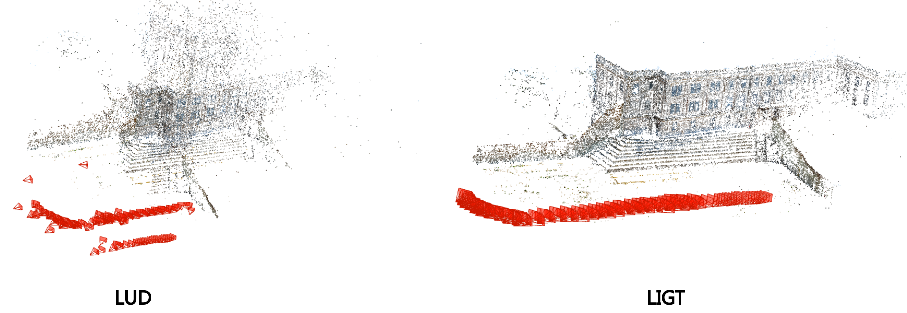
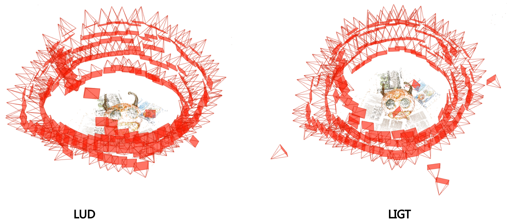
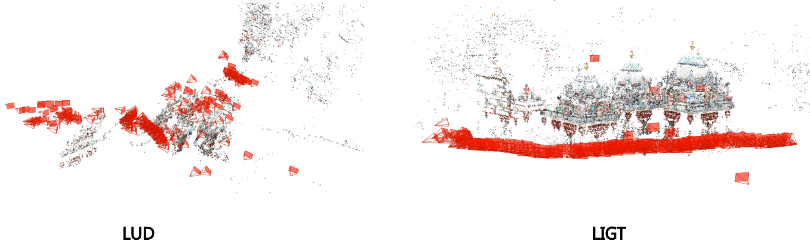

Graph Optimizer
===============

[](https://travis-ci.com/AIBluefisher/GraphOptim) [](./LICENSE)


This repo contains the official implementation of our CVPR 2021 paper - [Hybrid Rotation Averaging: A Fast and Robust Rotation Averaging Approach](https://arxiv.org/pdf/2101.09116.pdf). This library contains not only rotation averaging solvers, but also some popular methods in 3D vision, such as translation averaging, clustering, etc. The library is designed to deal with large scale optimization problems, and is easy to extend. Feel free to contribute to this project.

## 1. Features

* A library which solves the optimization problems in 3D vision.
* A template-based graph module which is easy to extend and to manipulate graph structures.
* Rotation averaging solvers achieves state-of-the-art.
* Translation averaging solvers (LUD, LiGT, BATA).
* Global SfM pipeline

## 2. Compilation

The library is compiled and tested on Ubuntu 16.04/18.04/20.04. We would like to support more platforms in the future.

### 2.1 Basic Requirements

This project requires Eigen 3.2. And Ceres 1.14.0 is currently used for nonlinear optimization. You can install all the dependencies through the `./scripts/dependencies.sh`.

```sh
bash ./scripts/dependencies.sh
```

### 2.3 Build GraphOptim

Follow [build.sh](build.sh) or execute the command below:

```sh
git clone https://github.com/AIBluefisher/GraphOptim.git
cd GraphOptim
mkdir build && cd build
cmake ..
make -j8
sudo make install
```

### 2.4 Build GlobalSfM

Once we installed GraphOptim, we can use it as an external library. And also, we can try the provided global SfM application. 

At first, try to install my folk of COLMAP. Then main difference between this folk and COLMAP is that my folk **stores relative poses into the database** while COLMAP does not.

```sh
# COLMAP dependencies
sudo apt-get install \
    git \
    cmake \
    build-essential \
    libboost-program-options-dev \
    libboost-filesystem-dev \
    libboost-graph-dev \
    libboost-regex-dev \
    libboost-system-dev \
    libboost-test-dev \
    libeigen3-dev \
    libsuitesparse-dev \
    libfreeimage-dev \
    libgoogle-glog-dev \
    libgflags-dev \
    libglew-dev \
    qtbase5-dev \
    libqt5opengl5-dev \
    libcgal-dev \
    libcgal-qt5-dev

# ceres-solver
sudo apt-get install libatlas-base-dev libsuitesparse-dev
git clone https://ceres-solver.googlesource.com/ceres-solver
cd ceres-solver
git checkout $(git describe --tags) # Checkout the latest release
mkdir build
cd build
cmake .. -DBUILD_TESTING=OFF -DBUILD_EXAMPLES=OFF
make
sudo make install

git clone https://github.com/AIBluefisher/colmap
cd colmap
mkdir build && cd build
cmake .. && make -j8
sudo make install
```

Then, we can build GlobalSfM pipeline by checking into the applications subfolder:
```sh
cd applications
mkdir build && cd build
cmake ..
make -j8
```

## 3. Running Examples

### 3.1 Rotation Averaging

```sh
./build/bin/rotation_estimator --g2o_filename=./data/synthetic/20_2.g2o
```

You can also try other `g2o` files.

### 3.2 Translation Averaging

The translation averaging methods are decoupled from another project.

```sh
./build/bin/position_estimator --g2o_filename=./data/synthetic/20_2.g2o
```

### 3.3 Global Structure from Motion

COLMAP provides only incremental Structure-from-Motion pipelines. To mitigate this issue, we implement a global SfM pipeline based on [TheiaSfM](https://github.com/sweeneychris/TheiaSfM). The implementation can provide a fair comparison to other methods, since most work uses COLMAP's keypoints and feature matcher while TheiaSfM uses different keypoints extraction and matching method, which is not suitable to do a fair comparison.

```sh
./applications/run_global_sfm.sh $DATASET_PATH $OUTPUT_PATH $VOC_TREE_PATH $MOST_SIMILAR_IMAGES_NUM
```
You may also want to try different rotation averaging and translation averaging solvers by setting (just appending the parameters at the end of your command):
- `ROTATION_ESTIMATOR_TYPE`: [[ROBUST_L1L2](https://ieeexplore.ieee.org/document/7898474/), [HYBRID](https://openaccess.thecvf.com/content/CVPR2021/papers/Chen_Hybrid_Rotation_Averaging_A_Fast_and_Robust_Rotation_Averaging_Approach_CVPR_2021_paper.pdf)]
- `POSITION_ESTIMATOR_TYPE`: [[LUD](https://web.math.princeton.edu/~amits/publications/CVPR2015-SfM-Published.pdf), [LIGT](https://arxiv.org/pdf/2103.01530.pdf)]

It is recommended to use **LIGT** as the translation averaging solver, as it performs always better than LUD in the test. **Tests are based on the dataset collected by [Olsson](https://www.maths.lth.se/matematiklth/personal/calle/dataset/dataset.html)**:

<details>
<summary>Alcatraz_courtyard [Click to view results]</summary>



</details>


<details>
<summary>pumpkin [Click to view results]</summary>



</details>

<details>
<summary>Sri Mariamman [Click to view results]</summary>



</details>


### 3.4 View Graph Synthesize

GraphOptim also supports to generate a synthesized dataset to train SOTA pose 
synchronization models. Implementation is adapted from [NeuRoRa](https://github.com/pulak09/NeuRoRA)'s matlab code.

```sh
./build/bin/view_graph_synthesizer \
  --num_threads=8 \
  --num_scenes=1250 \
  --output_dir=./
```

## 4. Use GraphOptim as a 3rd-party library

```cmake
find_package(Gopt REQUIRED)
if(GOPT_FOUND)
  message(STATUS "Found GOPT_INCLUDE_DIRs ${GOPT_INCLUDE_DIRS}")
  message(STATUS "Found GOPT_LINK_DIRs ${GOPT_LINK_DIRS}")
  message(STATUS "Found GOPT_LIBRARIES ${GOPT_LIBRARIES}")
else(GOPT_FOUND)
  message(FATAL "GOPT not found!")
endif(GOPT_FOUND)

include_directories(${GOPT_INCLUDE_DIRS})
link_directories(${GOPT_LINK_DIRS})

add_library(${YOUR_LIB} *.h *.cc)
target_link_libraries(${YOUR_LIB} ${GOPT_LIBRARIES})

add_executable(${YOUR_EXE} *.h *.cc)
target_link_libraries(${YOUR_EXE} ${GOPT_LIBRARIES})
```

### Citation

If you find the code useful for your research, please consider cite our paper:
```
@inproceedings{DBLP:conf/cvpr/Chen0K21,
  author    = {Yu Chen and
               Ji Zhao and
               Laurent Kneip},
  title     = {Hybrid Rotation Averaging: {A} Fast and Robust Rotation Averaging
               Approach},
  booktitle = {{IEEE} Conference on Computer Vision and Pattern Recognition},
  pages     = {10358--10367},
  year      = {2021}
}
```